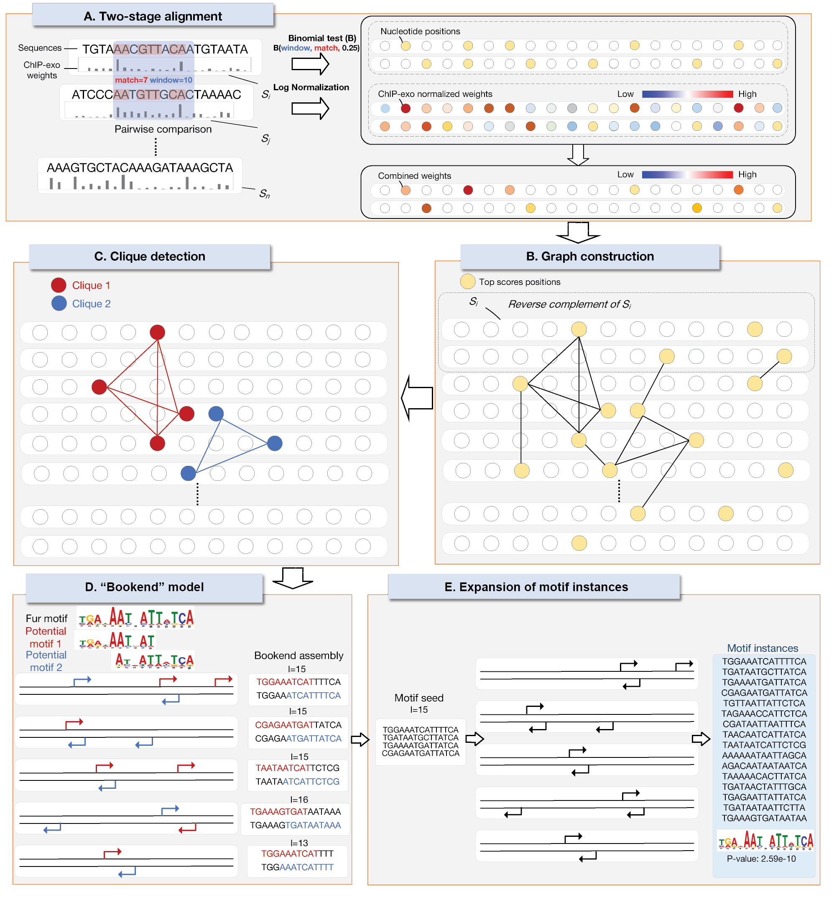

# TESA

## Overview

We introduce the TESA algorithm, which is a novel motif discovery algorithm designed for ChIP-exo data. ChIP-exo is a high-resolution DNA sequencing technique that improves the accuracy and precision of motif discovery compared to traditional ChIP-seq methods. TESA utilizes a weighted two-stage alignment procedure that takes into account positional sequencing coverage to allocate weights to sequence positions. This allows for the accurate localization of TF-DNA interaction sites and the assessment of closely located or overlapping binding occurrences. Experimental results demonstrate that TESA outperforms other motif discovery algorithms in terms of precision and the reconstruction of Position Weight Matrices (PWM) when applied to both prokaryotic and eukaryotic ChIP-exo datasets. The availability of the TESA source code and benchmark datasets further enhances its potential as a valuable tool in genomic research.

Overall, we highlight the significance of TESA in improving motif discovery accuracy and precision by leveraging the higher resolution and precise localization offered by ChIP-exo data. The algorithm's weighted two-stage alignment procedure and incorporation of a "bookend" model contribute to its superior performance in identifying DNA binding patterns. The comparisons with other motif discovery algorithms and the availability of benchmark datasets further validate the effectiveness of TESA in genomic research.



## How TESA works

TESA incorporates a weighted two-stage alignment procedure and a "bookend" model to accurately identify DNA binding patterns. The algorithm consists of the following steps:

### 1. Two-Stage Alignment

TESA constructs a matrix with dimensions 2𝑚 × 𝑛, where 𝑚 is the number of input sequences and 𝑛 is the length of each sequence. The matrix represents both the input sequences and their reverse complementary sequences. Each position in the matrix is assigned a normalized sequencing coverage. TESA allocates weights to pairs of segments, each of length 𝑙, between different sequences based on string similarity and sequencing coverage. The statistical significance of string similarity between segments is evaluated using the binomial distribution.

### 2. Graph Construction

After the two-stage alignment, TESA constructs a graph 𝐺 using the top-scoring positions from the alignment. The graph incorporates both the input sequences and their reverse complements, with each position connected by an edge.

### 3. Motif Detection

Cliques (complete subgraphs) are detected within the constructed graph using a heuristic algorithm. These cliques serve as potential motifs.

### 4. "Bookend" model

A specialized "bookend" method is deployed to optimize the length of the motifs by assessing the sequential overlaps between pairs of potential motifs.

### 5. Motif Expansion

In the final step, TESA expands the sets of motif instances identified in Step 4. The algorithm selects segments with elevated motif match scores and uses these instances to construct the motif PWM.

## Sequence set

The sequence set refers to the collection of DNA sequences that are used as input data for motif discovery algorithms. The sequence set is specifically derived from ChIP-exo data. The ChIP-exo data includes the reference genome file in FASTA format, a narrow peak file in BED format, and one or multiple sequencing coverage files in BigWig format. These files are processed and transformed into the TESA format, which combines the narrow peaks represented in FASTA format with normalized sequencing coverages. This sequence set is then used as input for the TESA algorithm to identify DNA binding motifs.

## Installation

Enter the folder "tesa" and type "make" then the compiled codes are within the same directory as the source.

## Inputs and outputs

The major program in the provided package is `tesa`, it can parse standard fasta format of files (allowing squences with different length), and example file are provided. 

To see help and look at all available options.

```console
$ ./tesa -h (./tesa)
```

Take a look at `example` (fasta file) first. And try to run tesa under a specific length, now we can handle length of segments during two-stage alignment (potential motifs) more than or equal to 5 (controlled in write_block.c line 256).

```console
$ ./tesa -i example -l 14
```

For each input file under a specific length l, our program generates a output file, namely, '.closures' file. In '.closures' file, it provides all the closures, representing motif profiles, in the increasing order of their pvalues.

Then try to run tesa recognizing the correct length in the scope [L,U] by our program automatically

```console
$ ./tesa -i example -L 14 -U 16
```

L and U are low boundary and up boundary of scope of length of potential motifs separately. We use this pair of parameters when we do not know the accurate length in advance. We sort the top n closures under each specific length in the increasing order of their pvalues and save the top o clousres in the ".closures" file. Especially, when the input value of L equals to U, it is equivalent to finding motifs in a specific length. '$ ./tesa -i example -L 14 -U 14' is equivalent to '$ ./tesa -i example -l 14'.

## Running TESA using an input file with sequencing coverage

You can run TESA with another option using base coverage signal according to the following instructions:
 
1. Make sure both ```Bedtools``` and ```BigWigMerge``` are ready.
2. A peak file with BED format(for instance, [PREFIX].bed), two bigwig files named [PREFIX]_Forward.bw and [PREFIX]_Reverse.bw respectively and a reference file with FASTA format with its reference with FAI format are required. For instance, there is a toy run with test.bed, test_Forward.bw, test_Reverse.bw, sequence.fa and sequence.fa.fai as input. Additionally, you can generate reference using samtools.
3. Run preprocessing script and generate output file *.tesa.
```console
$ chmod +x preprocess.sh
$ ./preprocess.sh [PEAK_PREFIX] [REFERENCE_FILE] [REFERENCE_INDEX_FILE] [OUTPUT_PREFIX]
```
For instance:
```console
$ ./preprocess.sh TEST sequence.fa sequence.fa.fai TEST_out
```   
4. Run TESA beyond new input with base coverage signal.
```console
$ ./tesa [OUTPUT_PREFIX].tesa
```
## Parameters

| Option  | Parameter | Description | Default |
| ------------- | ------------- | ------------- | ------------- |
| -l  | length  | length of potential motifs [5,l] | Specify length of potential motifs. In general, this value should be greater than 5. | 14 |
| -L  | length of potential motifs [L,U] | Specify minimum length of potential motifs. This parameter only takes effect when l is not specified. | Not effective |
| -R | range | The range when we use [L,U] | 1 in default |  
| -U  | length of potential motifs [L,U] | Specify maximum length of potential motifs. Must have a value greater than L. This parameter only takes effect when l is not specified. | Not effective |
| -o  | number of closures  | Number of closures to report (used under a specific input length). Only effective when the value is greater than the total number of closures found by this tool. | Report 10 closures in default. |
| -n  | number of closures  | Top n closures under each length are used when L < U. Only effective when the value is greater than the total number of closures found by this tool. | Not effective. |
| -B  |  reverse complement | TRUE or FALSE whether to search reverse complement. If it is set TRUE ture， the program will search both the forward complement and reverse complement. | TURE in default which means input sequence should be bidirectional. |
| -w | weight | Should be set with a positive integer. The weight of the two motif ends | The defalut weight is 2. |
| -k | motif seeds size | Should be set with a positive integer. The minimum size of the initial motif seeds. | It is strongly recommended not to set it smaller than the default value 3. |
| -c | consistency ratio | The consistency level of the motif seeds. Should be set beween (0.5-1.0]. | A ratio with default 1. Must be strictly greater than 0.5. |
| -s | simulation times | The nunber of simulation times when generating motif closures. A positive integer greater than or equal to 5.| 5 in default. Increasing this parameter will increase the runtime. |
| -u | similarity socre | The threshold of two closures' similarity socre (0,1].| Default threshold is 0.95 |
| -a | upper limit | The upper limit of conservation level (N,10]. | (9,10] in default |
| -N | lower limit | The lower limit of conservation level (0,a).| (0,6] in default |
| -P | palindromic | TRUE or FALSE, the flag of palindromic of TFBS. | FALSE in default |
| -M | mirror | TRUE or FALSE, the flag of mirror of TFBS. | FALSE in default |     
| -e | enlargement | The times of seed alignments enlargement. A positive integer between [1,3] | 3 in default |  
| -b | background | The conserve level (0,1] when search in background genome. Only effective when background gene exists | 0.95 in default|  
| -W | sequences weight | TRUE or FALSE, the flag of considering sequences weight. | FALSE in default |  
| -A | approximation | TRUE or FALSE, the flag of approximation of pvalue calculation. | FALSE in default |  
| -G | global | TRUE or FALSE, the flag of global TF prediction. | FALSE in default |  
| -C | local | TRUE or FALSE, the flag of local TF prediction.  | FALSE in default |  
| -E | expansion | TRUE or FALSE, the flag of expansion of closures base on the threshold 0.3-0.8. | FALSE in default |  
| -F | fast | TRUE or FALSE, the flag of fast version of wtsa which just enhance two ends of motif | FALSE in default |  

     
## Contact

Any questions, problems, bugs are welcome and should be dumped to
Cankun Wang <cankun.wang@osumc.edu>

